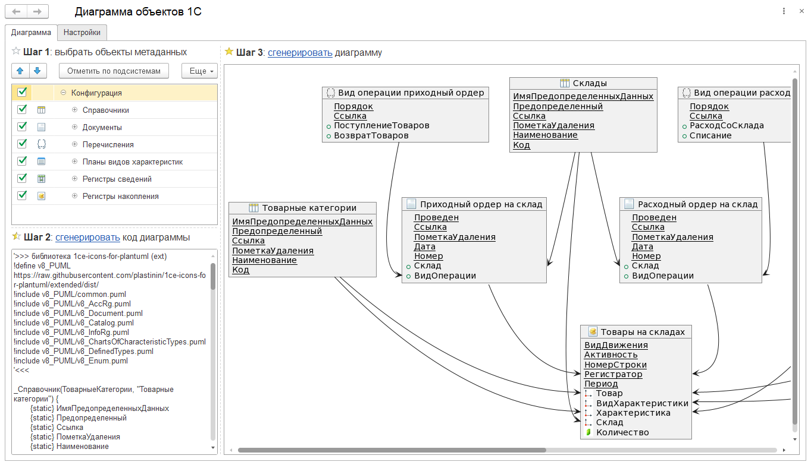
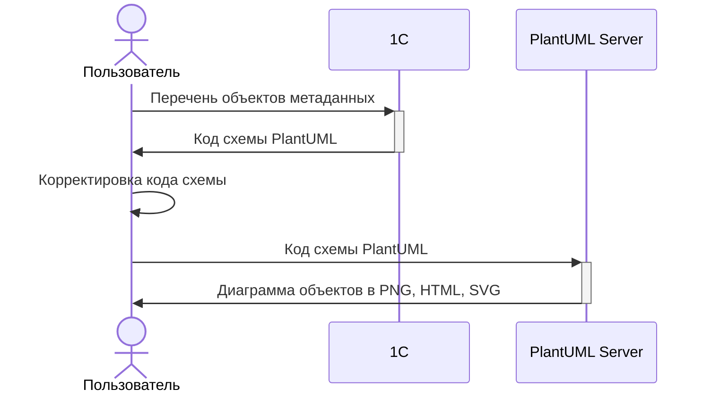

# Диаграмма объектов 1С

## Логика работы

## Области применения

- ТЗ, ЧТЗ, ФТ и прочая проектная документация
- Active Design Review
- Как пример работы с [PlantUML](https://plantuml.com/)

## Настройки

Настройка | Назначение | Значение по-умолчанию
---------|----------|---------
 Сервер рендеринга |  Можно задать альтернативный сервер генерации изображений (например можно использовать не только публичные сервера, но и собственные внутри локальной сети) | `www.plantuml.com`
 Ресурс сервера | Определяет тип изображения | `/plantuml/png/`
 Таймаут | Таймаут для HTTP соединения | `180`
Формировать реквизитный состав объекта |  Генерировать код для реквизитного состава объектов: стандартные реквизиты, реквизиты, табличные части| `Ложь`
Выводить предопределенные реквизиты |  Настройка активна при включенном признаке _Формировать реквизитный состав объекта_. При **включенном** признаке будут отображаться предопределенные реквизиты объектов метаданных | `Ложь`
Формировать детальные отношения на уровне реквизитов состав объекта |  Настройка активна при включенном признаке _Формировать реквизитный состав объекта_. При **включенном** признаке отрисовка связей будет осуществялться на уровне реквизитов. При **выключенном** отрисовка связяей будет на уровне объектов | `Ложь`
Выводить в формате HTML |  При **включенном** параметре диаграмма сформируется в формате HTML | `Ложь`

## Публикации

- [Техкружок 2.7](https://www.youtube.com/watch?v=psK2fZUtbf4)

## Благодарность со ссылками на инструменты использующиеся в проекте

- [Генерация UML диаграмм на основании текстового описания](https://infostart.ru/public/1513591/)
- [Библиотека Дмитрия Овчаренко: 1ce-icons-for-plantuml](https://github.com/ovcharenko-di/1ce-icons-for-plantuml)
- [Расширенная версия библиотеки: 1ce-icons-for-plantuml](https://github.com/plastinin/1ce-icons-for-plantuml)

## Развитие

**Разработка**: 1С: EDT

**Руководство контрибьтора** ⚒: [позаимствуем у проекта Let's code](https://github.com/plastinin/let-s-code/blob/develop/docs/README.md)

**Бэклог задач**: [Issues](https://github.com/plastinin/diagramobject/issues)